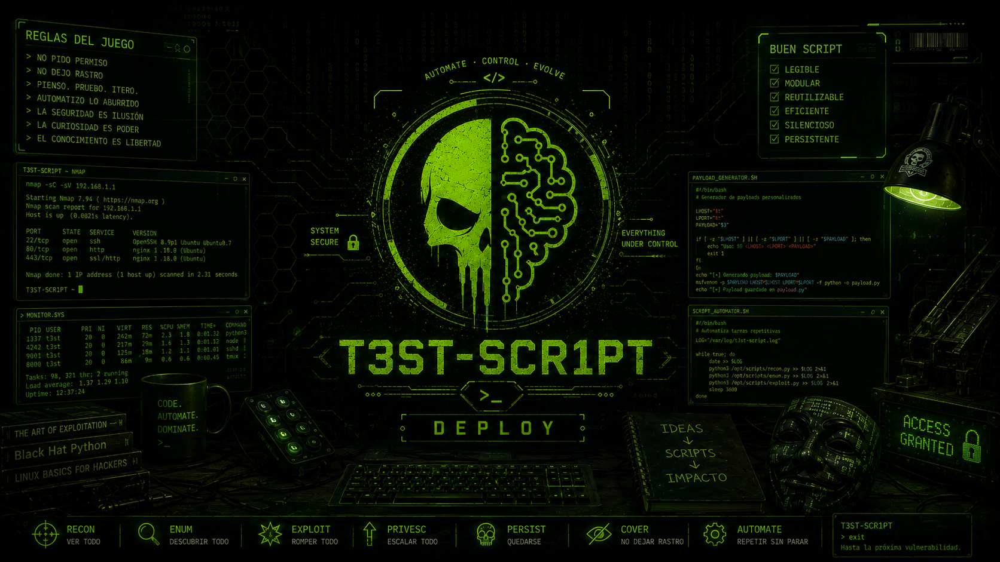
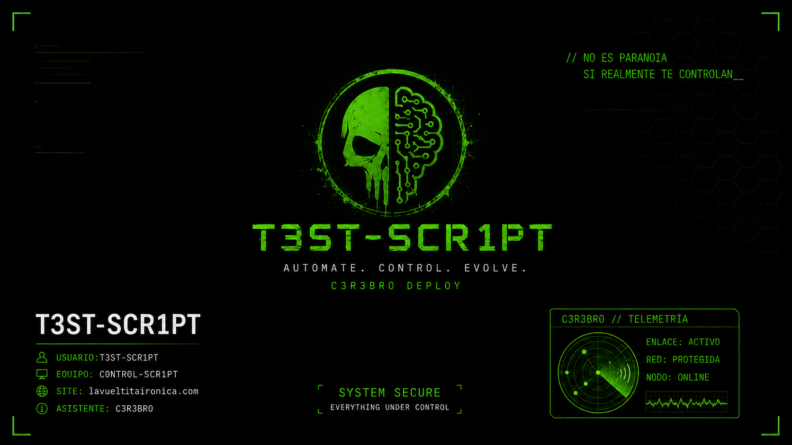

<div align="center">

# D3PL0Y

### Despliegue automatizado y modular para Windows 11

[](./D3PL0Y.ps1)


**Un único instalador. Dos perfiles. Menos configuración manual y menos oportunidades para que Windows improvise.**



</div>

---

## ¿Qué es D3PL0Y?

**D3PL0Y** es un script de PowerShell que prepara equipos con Windows 11 aplicando una configuración común y permitiendo elegir entre distintos perfiles de instalación.

Actualmente incluye:

- **T3ST-SCR1PT**, orientado a uso general, administración y trabajo diario.
- **STUD10-SCR1PT**, orientado a edición de imagen, vídeo y música.

El script instala aplicaciones, elimina bloatware seleccionado, configura privacidad, personaliza Windows, descarga los recursos visuales del perfil elegido y genera registros completos de la ejecución.

---

## Instalación rápida

Abre **PowerShell como administrador** y ejecuta:

```powershell
irm https://lavueltitaironica.com/install | iex
```

D3PL0Y mostrará el selector interactivo:

```text
╔════════════════════════════════════════════════════╗
║              SELECCIONA EL D3PL0Y                  ║
╠════════════════════════════════════════════════════╣
║ [1] T3ST-SCR1PT                                    ║
║     Equipo general: Chrome, Drive y Tailscale      ║
║                                                    ║
║ [2] STUD10-SCR1PT                                  ║
║     Edición: añade Audacity y GIMP                 ║
║                                                    ║
║ [0] Cancelar                                       ║
╚════════════════════════════════════════════════════╝
```

> [!IMPORTANT]
> El script requiere permisos de administrador y reiniciará el equipo 30 segundos después de finalizar, incluso si alguna fase ha terminado con errores. El reinicio puede cancelarse durante la cuenta atrás con `shutdown /a`.

---

## Perfiles disponibles

| Característica | T3ST-SCR1PT | STUD10-SCR1PT |
|---|---:|---:|
| Google Chrome | ✅ | ✅ |
| Google Drive | ✅ | ✅ |
| Tailscale | ✅ | ✅ |
| Audacity | ❌ | ✅ |
| GIMP 3 | ❌ | ✅ |
| Configuración general de Windows | ✅ | ✅ |
| Debloat seleccionado | ✅ | ✅ |
| Tema oscuro y personalización | ✅ | ✅ |
| Cursores D3PL0Y | ✅ | ✅ |
| Wallpaper propio | ✅ | ✅ |
| Pantalla de bloqueo propia | ✅ | ✅ |

### T3ST-SCR1PT

Perfil general para equipos de uso diario, administración y acceso a la infraestructura T3ST-SCR1PT.

<table>
<tr>
<td align="center"><strong>Escritorio</strong></td>
<td align="center"><strong>Pantalla de bloqueo</strong></td>
</tr>
<tr>
<td></td>
<td></td>
</tr>
</table>

### STUD10-SCR1PT

Perfil orientado a estaciones de edición de imagen, vídeo y música. Incluye las aplicaciones creativas adicionales y su propia identidad visual.

<table>
<tr>
<td align="center"><strong>Escritorio</strong></td>
<td align="center"><strong>Pantalla de bloqueo</strong></td>
</tr>
<tr>
<td></td>
<td></td>
</tr>
</table>

---

## Configuración aplicada

### Sistema y energía

- Desactiva la hibernación.
- Evita la suspensión automática con corriente y batería.
- Evita el apagado automático de la pantalla con corriente y batería.
- Actualiza las fuentes de WinGet antes de instalar aplicaciones.

### Privacidad y contenido promocional

- Reduce sugerencias, recomendaciones y aplicaciones promocionadas.
- Desactiva características de consumo de Windows mediante políticas.
- Reduce la telemetría mediante el Registro.
- Desactiva Windows Copilot mediante política cuando el sistema lo permite.

### Explorador y escritorio

- Activa el tema oscuro para aplicaciones y sistema.
- Muestra las extensiones de archivo.
- Muestra archivos ocultos.
- Oculta Widgets, Vista de tareas y el cuadro de búsqueda de la barra de tareas.
- Mantiene los iconos de la barra de tareas centrados.
- Aplica el color de énfasis verde de T3ST-SCR1PT.

### Ratón y cursores

- Descarga el paquete de cursores desde el repositorio.
- Aplica el esquema `D3PL0Y`.
- Configura el cursor verde.
- Ajusta el tamaño y la sensibilidad del puntero.

### Debloat

D3PL0Y intenta retirar, entre otras, aplicaciones preinstaladas relacionadas con:

- Xbox
- Clipchamp
- Phone Link
- Microsoft Teams
- Get Help y Get Started
- Feedback Hub
- Música y vídeo heredados de Microsoft
- People
- Microsoft Solitaire Collection
- Power Automate Desktop

La eliminación se realiza tanto sobre los paquetes instalados como sobre los paquetes aprovisionados para usuarios nuevos.

---

## Ejecución local

También puedes descargar el repositorio y ejecutar el script directamente:

```powershell
git clone https://github.com/t3st-scr1pt/D3PL0Y.git
cd D3PL0Y
.\D3PL0Y.ps1
```

### Seleccionar un perfil sin mostrar el menú

```powershell
.\D3PL0Y.ps1 -D3PL0YProfile T3ST-SCR1PT
```

```powershell
.\D3PL0Y.ps1 -D3PL0YProfile STUD10-SCR1PT
```

### Parámetros disponibles

| Parámetro | Descripción |
|---|---|
| `-D3PL0YProfile` | Selecciona directamente `T3ST-SCR1PT` o `STUD10-SCR1PT`. |
| `-NoRestart` | Evita el reinicio automático al terminar. |
| `-SkipDebloat` | Omite la eliminación de aplicaciones preinstaladas. |
| `-RefreshAssets` | Fuerza una nueva descarga de cursores y fondos. |

> [!NOTE]
> Los parámetros se utilizan al ejecutar el archivo `D3PL0Y.ps1` localmente. La instalación abreviada con `irm ... | iex` está pensada para usar el menú interactivo.

---

## Requisitos

- Windows 11, compilación 22000 o posterior.
- Windows PowerShell 5.1 o superior.
- Ejecución como administrador.
- Conexión a Internet.
- WinGet disponible mediante **App Installer**.
- Acceso al repositorio de GitHub y a los recursos alojados en él.

---

## Archivos generados

D3PL0Y utiliza la carpeta principal:

```text
C:\D3PL0Y
├── Configs
├── Logs
│   ├── estado.txt
│   ├── Resumen.txt
│   └── install-AAAAmmdd-HHMMSS.log
└── Wallpapers
```

La imagen de bloqueo se guarda en:

```text
C:\ProgramData\D3PL0Y\
```

Los cursores se almacenan dentro del perfil del usuario:

```text
%LOCALAPPDATA%\Microsoft\Windows\Cursors\
```

---

## Estructura del repositorio

```text
D3PL0Y/
├── configs/
│   └── cursors/
├── wallpapers/
│   ├── t3st-scr1pt.png
│   ├── t3st-scr1pt_lockscreen.png
│   ├── stud10-scr1pt.png
│   └── stud10-scr1pt_lockscreen.png
├── D3PL0Y.ps1
├── README.md
└── Tweaks.reg
```

Los nombres de los cuatro archivos visuales deben mantenerse exactamente como aparecen arriba, ya que el perfil seleccionado los descarga de forma automática.

---

## Qué no modifica

D3PL0Y no realiza las siguientes acciones:

- No redirige Escritorio, Documentos, Descargas ni otras carpetas personales.
- No monta Google Drive como una unidad personalizada.
- No crea scripts secundarios de configuración.
- No instala Audacity ni GIMP en el perfil T3ST-SCR1PT.
- No oculta los errores: cada fase queda registrada en el resumen y en el log completo.

---

## Comprobar el script antes de ejecutarlo

La instalación remota es cómoda, pero ejecutar código directamente desde una URL implica confiar en el contenido servido en ese momento. Para revisarlo antes, puedes descargarlo sin ejecutarlo:

```powershell
Invoke-WebRequest https://lavueltitaironica.com/install -OutFile .\D3PL0Y.ps1
notepad .\D3PL0Y.ps1
```

Después de revisarlo:

```powershell
.\D3PL0Y.ps1
```

---

## Estado del proyecto

**Versión actual: 2.0**

- Selector interactivo de perfiles.
- Perfil general T3ST-SCR1PT.
- Perfil creativo STUD10-SCR1PT.
- Aplicaciones y fondos independientes por perfil.
- Registro detallado de fases, avisos y errores.
- Reinicio automático tras la ejecución, salvo uso explícito de `-NoRestart`.

---

<div align="center">

### T3ST-SCR1PT · D3PL0Y

**Configurar. Desplegar. Reiniciar. Descubrir qué nueva ocurrencia ha añadido Windows.**

</div>
