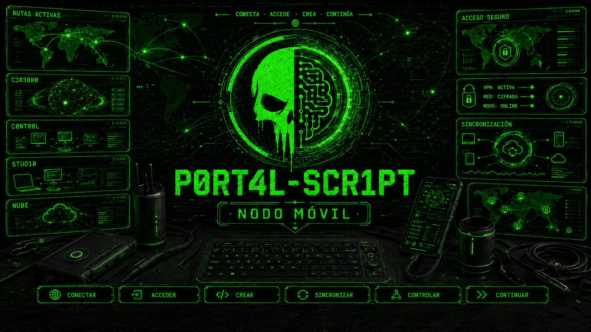
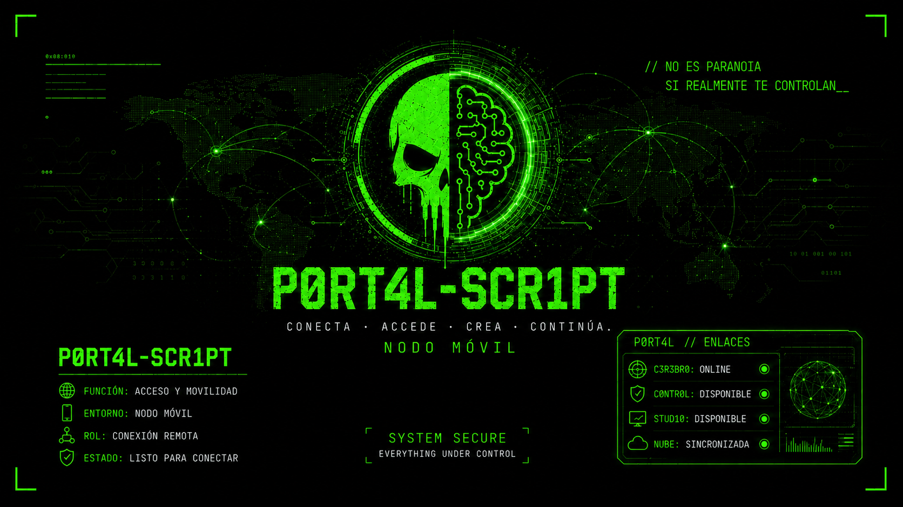
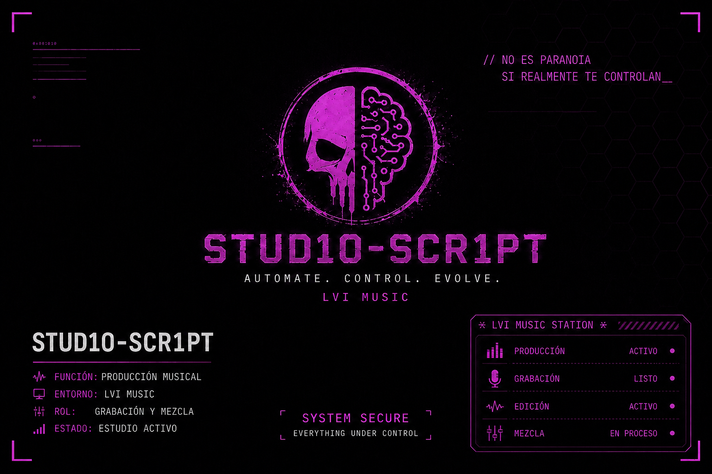
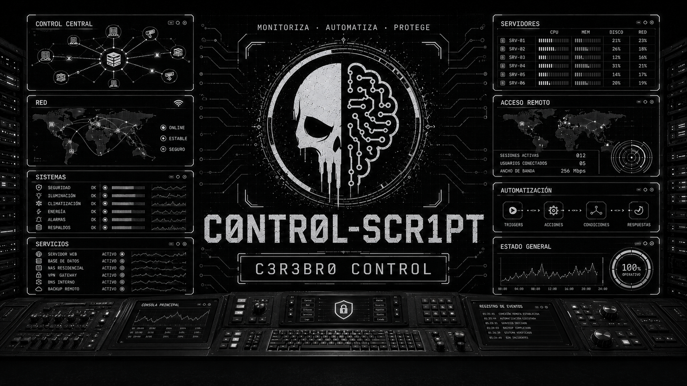
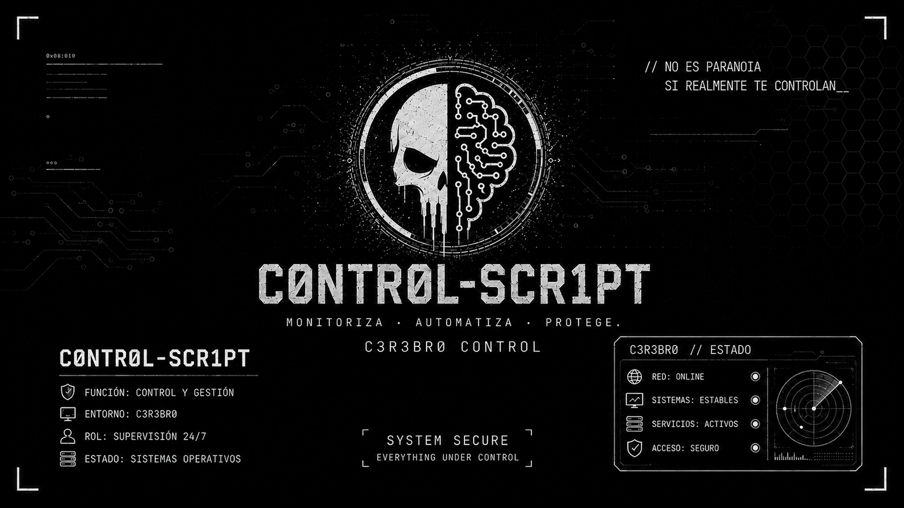

<div align="center">

# D3PL0Y

### Despliegue automatizado y modular para Windows 11

[](./D3PL0Y.ps1)


**Un único instalador. Tres perfiles. Menos configuración manual y menos oportunidades para que Windows improvise.**



</div>

---

## ¿Qué es D3PL0Y?

**D3PL0Y** es un script de PowerShell que prepara equipos con Windows 11 mediante una configuración común y tres perfiles especializados:

- **P0RT4L-SCR1PT**, para uso general, movilidad y trabajo diario.
- **STUD10-SCR1PT**, para edición de imagen, vídeo y música.
- **C0NTR0L-SCR1PT**, para administración, supervisión y disponibilidad 24/7.

El script asigna al equipo el nombre del perfil, instala sus aplicaciones, elimina bloatware seleccionado, aplica ajustes de privacidad y productividad, configura su identidad visual y genera registros de toda la ejecución.

---

## Instalación rápida

Abre **Windows PowerShell como administrador** y ejecuta:

```powershell
irm https://lavueltitaironica.com/install | iex
```

D3PL0Y mostrará el selector interactivo:

```text
╔════════════════════════════════════════════════════╗
║              SELECCIONA EL D3PL0Y                  ║
╠════════════════════════════════════════════════════╣
║ [1] P0RT4L-SCR1PT                                  ║
║     Equipo general: Chrome, Drive y Tailscale      ║
║                                                    ║
║ [2] STUD10-SCR1PT                                  ║
║     Edición: añade Audacity y GIMP                 ║
║                                                    ║
║ [3] C0NTR0L-SCR1PT                                 ║
║     Administración y disponibilidad 24/7           ║
║                                                    ║
║ [0] Cancelar                                       ║
╚════════════════════════════════════════════════════╝
```

> [!IMPORTANT]
> D3PL0Y requiere permisos de administrador. De forma predeterminada reinicia el equipo 30 segundos después de finalizar, incluso si alguna fase termina con errores. Durante la cuenta atrás puede cancelarse con `shutdown /a`.

---

## Perfiles disponibles

| Característica | P0RT4L | STUD10 | C0NTR0L |
|---|:---:|:---:|:---:|
| Google Chrome | ✅ | ✅ | ✅ |
| Google Drive | ✅ | ✅ | ✅ |
| Tailscale | ✅ | ✅ | ✅ |
| Audacity | ❌ | ✅ | ❌ |
| GIMP 3 | ❌ | ✅ | ❌ |
| PowerShell 7 | ❌ | ❌ | ✅ |
| Visual Studio Code | ❌ | ❌ | ✅ |
| Renombrado automático del equipo | ✅ | ✅ | ✅ |
| Configuración general de Windows | ✅ | ✅ | ✅ |
| Debloat seleccionado | ✅ | ✅ | ✅ |
| Tema oscuro y paleta propia | ✅ | ✅ | ✅ |
| Cursores D3PL0Y | ✅ | ✅ | ✅ |
| Wallpaper y pantalla de bloqueo propios | ✅ | ✅ | ✅ |
| Tailscale desatendido | ❌ | ❌ | ✅ |
| RDP con NLA limitado a Tailscale | ❌ | ❌ | ✅* |
| Refuerzo de seguridad | ❌ | ❌ | ✅ |
| Informe semanal de salud | ❌ | ❌ | ✅ |

\* El servidor RDP entrante requiere una edición compatible de Windows, como Pro, Enterprise o Education.

### P0RT4L-SCR1PT

Perfil general para un equipo portátil de uso diario. Instala Chrome, Drive y Tailscale, configura el nombre `P0RT4L-SCR1PT` y aplica la paleta verde de Windows con color principal `#107C10`.

<table>
<tr>
<td align="center"><strong>Escritorio</strong></td>
<td align="center"><strong>Pantalla de bloqueo</strong></td>
</tr>
<tr>
<td></td>
<td></td>
</tr>
</table>

### STUD10-SCR1PT

Perfil orientado a estaciones de edición de imagen, vídeo y música. Añade Audacity y GIMP 3, configura el nombre `STUD10-SCR1PT` y aplica la paleta morada con color principal `#602071`.

<table>
<tr>
<td align="center"><strong>Escritorio</strong></td>
<td align="center"><strong>Pantalla de bloqueo</strong></td>
</tr>
<tr>
<td></td>
<td></td>
</tr>
</table>

### C0NTR0L-SCR1PT

Perfil para un equipo de administración disponible 24/7. Instala PowerShell 7 y Visual Studio Code, configura el nombre `C0NTR0L-SCR1PT` y aplica la paleta gris claro con color principal `#D7DCE2`.

También prepara Tailscale en modo desatendido, protege el acceso RDP, refuerza ajustes básicos de seguridad y programa un informe semanal de salud.

<table>
<tr>
<td align="center"><strong>Escritorio</strong></td>
<td align="center"><strong>Pantalla de bloqueo</strong></td>
</tr>
<tr>
<td></td>
<td></td>
</tr>
</table>

---

## Configuración aplicada

### Sistema y energía

Los tres perfiles:

- Desactivan la hibernación.
- Actualizan las fuentes de WinGet antes de instalar aplicaciones.
- Cambian el nombre del equipo para que coincida con el perfil elegido.

El comportamiento energético depende del perfil:

| Ajuste | P0RT4L / STUD10 | C0NTR0L |
|---|---|---|
| Suspensión con corriente | Desactivada | Desactivada |
| Pantalla con corriente | 20 minutos | 10 minutos |
| Suspensión con batería | 30 minutos | No se modifica |
| Pantalla con batería | 10 minutos | No se modifica |
| Cerrar la tapa con corriente | Configuración existente | Sin acción |
| Inicio rápido | Configuración existente | Desactivado |

### Privacidad y contenido promocional

- Reduce sugerencias, recomendaciones, anuncios personalizados y aplicaciones promocionadas.
- Desactiva experiencias personalizadas basadas en datos de diagnóstico.
- Desactiva Windows Spotlight, la experiencia de bienvenida y las sugerencias de terceros mediante políticas.
- Solicita el nivel mínimo de telemetría admitido por la edición de Windows.
- Desactiva Windows Copilot mediante política cuando el sistema lo permite.

### Explorador, escritorio y productividad

- Activa el tema oscuro para aplicaciones y sistema.
- Muestra las extensiones de archivo y los archivos ocultos.
- Abre el Explorador en **Este equipo**.
- Recupera el menú contextual clásico.
- Oculta Widgets, Chat/Teams, Vista de tareas y el cuadro de búsqueda de la barra de tareas.
- Mantiene centrados los iconos de la barra de tareas.
- Desactiva las sugerencias web de la búsqueda, Game DVR y la captura de juegos.
- Habilita rutas de archivo largas.
- Aplica la paleta del perfil a ventanas, Inicio, controles y elementos de énfasis.

### Ratón y cursores

- Descarga el paquete completo de cursores desde el repositorio.
- Aplica el esquema `D3PL0Y`.
- Configura el cursor verde de accesibilidad.
- Ajusta el tamaño y la sensibilidad del puntero.

### Debloat

D3PL0Y desinstala OneDrive y retira, tanto para el usuario actual como para usuarios nuevos, paquetes relacionados con:

- Xbox, Xbox Live y Gaming App.
- Clipchamp, Teams, Skype y Phone Link.
- Microsoft To Do, Power Automate Desktop y el nuevo Outlook.
- Copilot, Get Help, Get Started y Feedback Hub.
- Noticias, Tiempo, Mapas, People y Microsoft 365 Hub.
- Música, vídeo, 3D, Mixed Reality y Solitaire.

Se mantienen deliberadamente Microsoft Store, WinGet, Terminal, Bloc de notas, Calculadora, Fotos, Paint, Cámara, Recortes, codecs, Seguridad de Windows y los componentes esenciales del sistema.

> [!NOTE]
> La desinstalación de OneDrive no elimina los archivos existentes dentro de la carpeta OneDrive del usuario.

---

## Funciones adicionales de C0NTR0L

### Tailscale desatendido

- Intenta activar `--unattended=true` si Tailscale ya está conectado.
- Si todavía falta iniciar sesión, crea la tarea `D3PL0Y-TailscaleUnattended` para completar el ajuste automáticamente después del inicio de sesión del usuario.
- No automatiza las credenciales ni el alta inicial en la tailnet.

### Escritorio remoto protegido

- Habilita RDP con autenticación a nivel de red (NLA), capa de seguridad reforzada y cifrado alto.
- Desactiva las reglas integradas de RDP que permiten acceso desde toda la red local.
- Crea reglas propias TCP y UDP para el puerto `3389`, limitadas al rango IPv4 de Tailscale `100.64.0.0/10`.
- Omite el servidor RDP entrante cuando la edición de Windows no lo admite.

### Base de seguridad

- Mantiene activos Firewall de Windows, SmartScreen y UAC.
- Reafirma la protección en tiempo real de Microsoft Defender cuando está disponible.
- Evita que Windows Update permanezca deshabilitado.
- Desactiva SMB1 si estuviera activo.
- Cierra las reglas de entrada SMB para no publicar carpetas accidentalmente.

### Informe semanal de salud

La tarea `D3PL0Y-C0NTR0L-Health` se ejecuta los domingos a las `03:00` como `SYSTEM` y registra:

- Versión de Windows y tiempo de actividad.
- Espacio libre y estado de los discos.
- Estado de Microsoft Defender.
- Actualizaciones pendientes.
- Salida HTTPS y estado de Tailscale.

Los informes se guardan en `C:\D3PL0Y\Logs\Health` y se conservan los 26 más recientes.

---

## Ejecución local

También puedes descargar el repositorio y ejecutar el script directamente:

```powershell
git clone https://github.com/t3st-scr1pt/D3PL0Y.git
cd D3PL0Y
.\D3PL0Y.ps1
```

### Seleccionar un perfil sin mostrar el menú

```powershell
.\D3PL0Y.ps1 -D3PL0YProfile P0RT4L-SCR1PT
```

```powershell
.\D3PL0Y.ps1 -D3PL0YProfile STUD10-SCR1PT
```

```powershell
.\D3PL0Y.ps1 -D3PL0YProfile C0NTR0L-SCR1PT
```

### Parámetros disponibles

| Parámetro | Descripción |
|---|---|
| `-D3PL0YProfile` | Selecciona `P0RT4L-SCR1PT`, `STUD10-SCR1PT` o `C0NTR0L-SCR1PT`. |
| `-NoRestart` | Evita el reinicio automático al terminar. |
| `-SkipDebloat` | Omite la desinstalación de OneDrive y de las aplicaciones preinstaladas. |
| `-RefreshAssets` | Fuerza una nueva descarga de los cursores. Los fondos se actualizan siempre. |

> [!NOTE]
> Los parámetros se utilizan al ejecutar `D3PL0Y.ps1` localmente. La instalación abreviada con `irm ... | iex` está pensada para utilizar el menú interactivo.

---

## Requisitos

- Windows 11, compilación 22000 o posterior.
- Windows PowerShell 5.1 o superior, ejecutado en 64 bits.
- Ejecución como administrador.
- Conexión a Internet.
- WinGet disponible mediante **App Installer**.
- Acceso a GitHub y a los recursos alojados en el repositorio.
- Para recibir conexiones RDP: Windows Pro, Enterprise, Education o una edición compatible.

---

## Archivos generados

D3PL0Y utiliza la siguiente estructura principal:

```text
C:\D3PL0Y
├── Configs
│   ├── C0NTR0L-HealthReport.ps1       # Solo C0NTR0L
│   └── Enable-TailscaleUnattended.ps1 # Solo C0NTR0L
├── Logs
│   ├── Health                         # Solo C0NTR0L
│   │   └── Health-AAAAmmdd-HHMMSS.txt
│   ├── estado.txt
│   ├── Resumen.txt
│   └── install-AAAAmmdd-HHMMSS.log
└── Wallpapers
```

La imagen de bloqueo se guarda en:

```text
C:\ProgramData\D3PL0Y\
```

Los cursores se almacenan dentro del perfil del usuario:

```text
%LOCALAPPDATA%\Microsoft\Windows\Cursors\
```

---

## Estructura del repositorio

```text
D3PL0Y/
├── configs/
│   └── cursors/
├── wallpapers/
│   ├── p0rt4l-scr1pt.png
│   ├── p0rt4l-scr1pt_lockscreen.png
│   ├── stud10-scr1pt.png
│   ├── stud10-scr1pt_lockscreen.png
│   ├── c0ntr0l-scr1pt.png
│   └── c0ntr0l-scr1pt_lockscreen.png
├── D3PL0Y.ps1
├── README.md
└── Tweaks.reg
```

Los nombres de los seis recursos visuales deben mantenerse exactamente como aparecen, ya que D3PL0Y los descarga según el perfil seleccionado.

---

## Qué no modifica ni automatiza

D3PL0Y no realiza las siguientes acciones:

- No modifica la BIOS/UEFI.
- No activa las propiedades avanzadas del adaptador Ethernet necesarias para Wake on LAN; por tanto, **WOL no queda garantizado por D3PL0Y**.
- No instala ni configura OpenSSH.
- No instala Git ni Sysinternals Suite.
- No redirige Escritorio, Documentos, Descargas ni otras carpetas personales.
- No monta Google Drive como una unidad personalizada.
- No copia credenciales ni automatiza el inicio de sesión de Google Drive, Chrome o Tailscale.
- No instala Audacity ni GIMP fuera del perfil STUD10.
- No instala PowerShell 7 ni Visual Studio Code fuera del perfil C0NTR0L.
- No habilita RDP entrante en ediciones de Windows que no incluyen el servidor de Escritorio remoto.
- No oculta los errores: cada fase queda reflejada en el resumen y en el registro completo.

---

## Comprobar el script antes de ejecutarlo

La instalación remota es cómoda, pero ejecutar código directamente desde una URL implica confiar en el contenido servido en ese momento. Para revisarlo antes, descárgalo sin ejecutarlo:

```powershell
Invoke-WebRequest https://lavueltitaironica.com/install -OutFile .\D3PL0Y.ps1
notepad .\D3PL0Y.ps1
```

Después de revisarlo:

```powershell
.\D3PL0Y.ps1
```

---

## Estado del proyecto

**Versión actual: 2.2.1**

- Selector interactivo con tres perfiles.
- Aplicaciones, nombres de equipo, paletas y fondos independientes.
- Limpieza conservadora de Windows y ajustes comunes de privacidad.
- Perfil C0NTR0L con configuración 24/7, seguridad, RDP por Tailscale e informe semanal.
- Registro detallado de fases, avisos y errores.
- Reinicio automático salvo uso explícito de `-NoRestart`.

---

<div align="center">

### T3ST-SCR1PT · D3PL0Y

**Configurar. Desplegar. Reiniciar. Descubrir qué nueva ocurrencia ha añadido Windows.**

</div>
